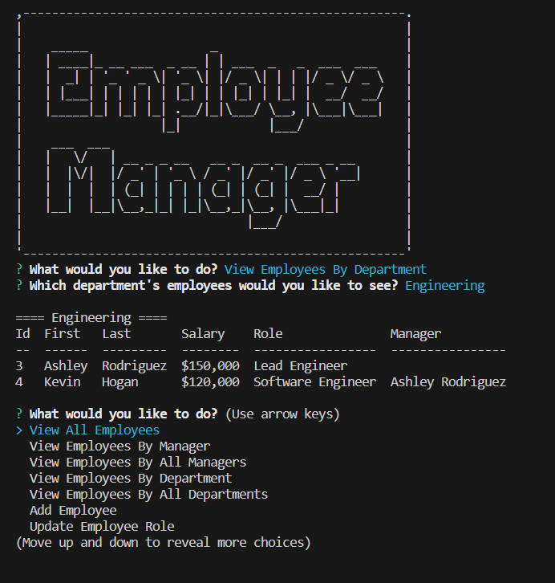

# Employee Tracker

## Description
A command-line application to manage a company's employee database.  

## Table of Contents

- [Installation](#installation)
- [Usage](#usage)
- [Credits](#credits)
- [License](#license)
- [How to Contribute](#guidelines)
- [Tests](#tests)
- [Questions](#questions)

## Installation

After cloning the repo
- Set up '.env' based on the provided example
- Type 'npm install'
- Use the database schema and seeds sql files with MySQL to create and seed the db
- Type 'npm start' to run the application

## Usage

Type 'npm start' to run the application
- Choose an option from the main menu
- Options include viewing tables for employees, roles, departments
- Update employee role
- Add new employees, roles, and departments

[Demo Video](tbd)

## Credits

* Node.js Copyright [OpenJS Foundation](https://openjsf.org/) and Node.js contributors. All rights reserved. 
* MySQL is © 2024 Oracle
* Inquirer is Copyright (c) 2023 Simon Boudrias

## License

This application is covered under the MIT License.

## How To Contribute

N/A

## Tests

N/A

## Questions

[GitHub Profile](https://github.com/kevinchogan)

For questions, please contact kchogan@pacbell.net.
